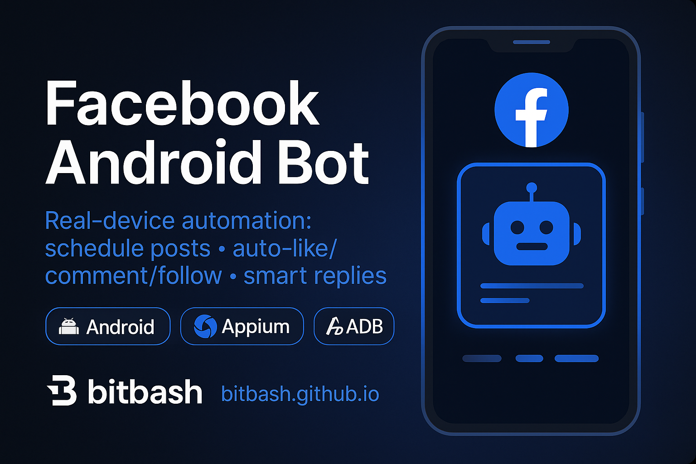

#  Facebook Bot – Android Automation for Facebook

<p align="center"> <a href="https://github.com/yourusername/facebook-bot">  </a> </p>

<p align="center">
  <a href="https://discord.gg/vBu9huKBvy">
    
  </a>
  <a href="https://t.me/devpilot1">
    
  </a>
</p>

---

##  Overview

**Facebook Bot** for Android automates key activities on your Facebook account including posting, reacting, commenting, friend requests, and group interactions.  
The bot runs in the background, performing scheduled actions, keeping your account active and engaging without manual supervision.

### Key Benefits:
- **Automated Posting**: Schedule posts on your timeline or pages at optimal times.  
- **Engagement Automation**: React and comment on posts automatically.  
- **Friend & Group Management**: Send friend requests and join groups intelligently.  
- **Message Auto-Reply**: Respond to messages automatically for timely communication.  
- **Background Operation**: Operates quietly on Android devices.  
- **Safe & Human-like**: Randomized delays, cooldowns, and optional proxy/fingerprint handling.

---

## 📂 Core Features

| **Feature**                         | **Description**                                                                                       |
|-------------------------------------|-------------------------------------------------------------------------------------------------------|
| **Scheduled Posts**                  | Automate posting to your timeline and Facebook pages at user-defined times.                           |
| **Auto-Reactions**                   | Like, love, or react to posts automatically based on preferences or hashtags.                         |
| **Auto-Commenting**                  | Comment on posts using pre-defined templates or AI-generated responses.                               |
| **Friend Request Automation**        | Send friend requests to users based on criteria or suggestions.                                       |
| **Join Groups Automatically**        | Discover and join Facebook groups relevant to your target audience.                                   |
| **Message Auto-Reply**               | Respond automatically to incoming messages for consistent engagement.                                 |
| **Background Automation**            | Runs quietly on Android devices without requiring manual input.                                       |
| **Proxy & Fingerprint Management**   | Optional integration to rotate IPs and device fingerprints for safer automation.                      |
| **Activity Logs**                     | Keep track of all automated actions with timestamps for monitoring and reporting.                     |

---

<p align="center">
  
</p>

##  Target Audience

- Social Media Managers  
- Digital Marketers  
- Content Creators & Influencers  
- Brands managing Facebook presence  
- Developers exploring automation  

---

##  Contact

-  [Join Discord Community](https://discord.gg/vBu9huKBvy)  
-  [Contact via Telegram](https://t.me/devpilot1)  

---

##  Installation Instructions

### 1. Clone the Repository
```bash
git clone https://github.com/yourusername/facebook-bot.git
cd facebook-bot
